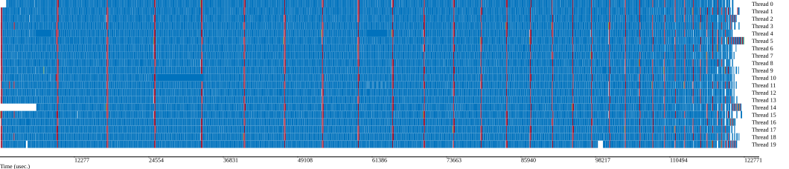

# OpenMP exercise: Cholesky factorization

By default, OpenMP will use the number of threads equal to the number of cores on the machine. To change the number of threads:

```bash
export OMP_NUM_THREADS=16
```

To compile, run and benchmark the code:

```bash
make && clear && ./main 100 40
```

The images are automatically generated and shown here.

## Issue

Cannot parallelize everything in the loop, because the result of the previous iteration is needed in the next iteration.

"j" loop is in blue, "i" loop is in red.

The naive sequential implementation is shown in [`chol_seq.c`](chol_seq.c).


## Part 1: simple loop parallelization

[`chol_par_loop_simple.c`](chol_par_loop_simple.c) can be optimized by parallelizing the inner "j" loop. This is because all the iterations of the "j" loop are independent of each other, and the result of the previous iteration is not needed in the next iteration.


The image clearly shows that the blue operations are parallelized. However, the red operations are not and are scattered all around.

## Part 2: improved loop parallelization

[`chol_par_loop_improved.c`](chol_par_loop_improved.c) is optimized by taking out the "j" loop and parallelizing it. This allows us to parallelize the "i" loop as well.

The `private` clause is necessary to ensure that k isn't shared between threads.

The `collapse` clause is not necessary, but it is used to extand the parallelization to both for loops.


The image clearly shows that the blue operations are still parallelized and even batched together (in their own for loop). The red operations are also parallelized, saving much time.

## Part 3: A complex, efficient DAG based parallelization

<!-- TODO -->


## Experimenting on a supercomputer

We can benchmark these different methods on a supercomputer to evalue their scalability.

we get the following results:


For each method, the trace isn't so different from the previous ones. UNLESS we look at the number of threads used: **79** !!!

### Simple loop parallelization


### Improved loop parallelization


### DAG based parallelization


